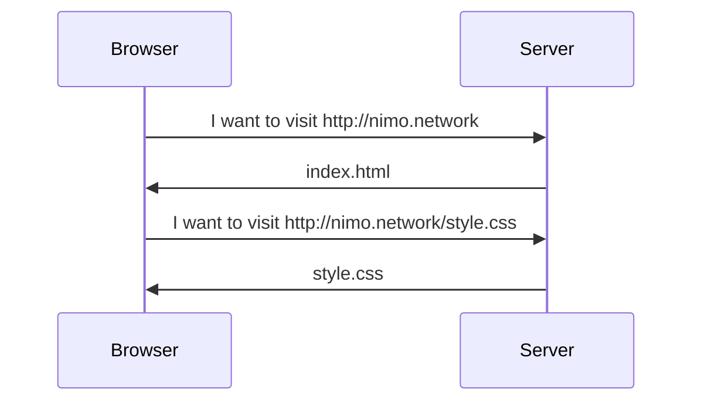
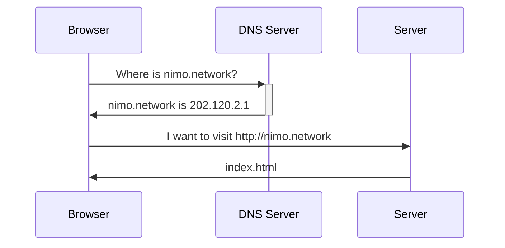
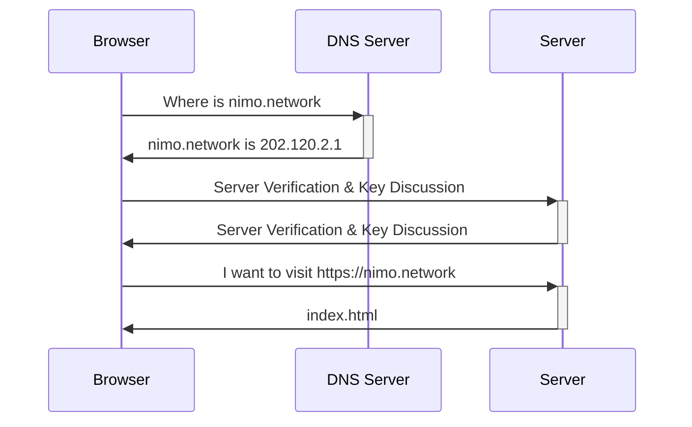
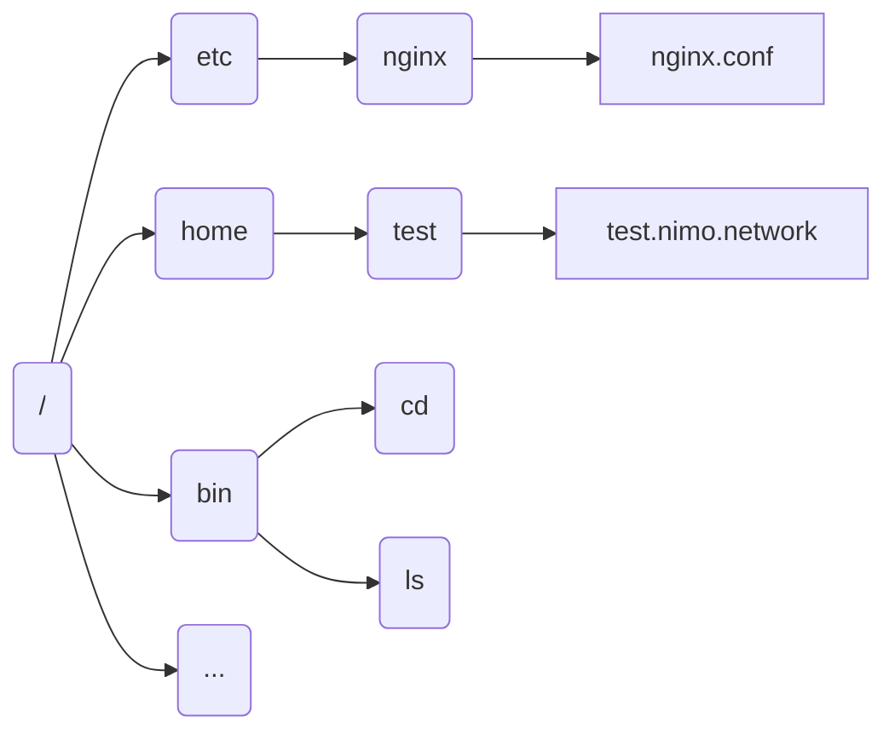

---
# try also 'default' to start simple
theme: seriph 
# apply any windi css classes to the current slide
class: 'text-center'
# https://sli.dev/custom/highlighters.html
highlighter: shiki
# show line numbers in code blocks
lineNumbers: true
# some information about the slides, markdown enabled
info: |
  HTTP & Linux Operation Basics
# persist drawings in exports and build
drawings:
  persist: true
background: 'https://source.unsplash.com/collection/94734566/1920x1080'
---

# Introduction to web development

HTTP & Linux Operation Basics

---

# Preface

- This lesson is not a vital part of frontend development, it does not matter if you do not understand.
- [w3school](https://www.w3schools.com) is a good website to learn basic HTML and CSS
- [cssreference.io](https://csreference.io) is a good website for learning CSS
- [CSS Tricks](https://css-tricks.com** is a good website for learning the latest technology of CSS

## Next lesson

We will talk about...

- CSS Flexbox
- CSS Grid
- Javascript Basics

**Please** make sure you read [Commonly used tools](https://nimo.network/post/00-widely-used-tools/) and install tools mentioned in the passage.

---

# What happened when you visit a website?

A classical but meaningful problem.



---

# What happened when you visit a website?

Seems so intuitive... But how can browser find the server? Domain Name System!



---

# What happened when you visit a website?

Oh..., how about `HTTPS`?

`HTTPS` = `HTTP` + `TLS`!

## What is it?

The process is based on `Asymmetric encryption`.

Asymmetric encryption means the key for encryption and decryption can be different.

The two keys are `public key` and `private key`.

---

# What happened when you visit a website?

Oh..., how about `HTTPS`?

## What can do with asymmetric encryption?

Assuming that the public key can be viewed by everyone, the private key can only be viewed by the owner.

- Example01: To prove a message is sent by myself, I use my private key to encrypt its, people use the public key to decrypt it. If the decryption is done successfully, the message is sent by myself.
- Example02: To prove I am `nimo.network`, visitors use a public key to encrypt a message, I decrypt it with my private key and send it back. If the message is the same, visitors believe that I am `nimo.network`.

---

# What happened when you visit a website?



---

# What we concern about?

- As a developer:
  - The `index.html` and other resource files
  - The rendering process in browser
- As an operator:
  - Domain & DNS settings
  - Domain Certificate
  - The serve of `index.html` and other resource files

---

# What is a server?

- A computer.
- Can be accessed from the Internet
- Port 80 and 443 opened

## Linux distributions

> Linux distributions are commonly used in servers.

<div grid="~ cols-4" class="mt-4">

<div class="text-center p-4">
  
  <p>Debian</p>
</div>

<div class="text-center p-4">
  
  <p>Ubuntu</p>
</div>

<div class="text-center p-4">
  
  <p>Fedora</p>
</div>

<div class="text-center p-4">
  
  <p>CentOS</p>
</div>

</div>

---

# How to access a server?

We can access a server via ssh

## Our Server

- IP : (Check our QQ Group)
- Port : (Check our QQ Group)
- Username : What you fill in the form
- Password : (Check our QQ Group)

Connect to the server via:
```bash
ssh -p <port> <username>@<ip>
```

## SSH

`SSH` stands for `Secure SHell`. Shell is a program for running other programs. Secure means our message are encrypted during transformation.

---

# Notice

- **DO NOT** use it for bypassing GFW
- **DO NOT** put sensitive info in the server
- All file **must** be backup in your computer
- **DO NOT** tell others the SSH Port or other sensitive info
- **DO NOT** use it for attacking / hacking other computer

There is **no** `sudo` privileges granted to your accounts.
If you cares, you can buy (rent, more precisely) a server yourself.

---

# Programs related to directory

The directory structure 



---

# Programs related to directory

Working directory is where you are

- pwd : print working directory, or where you are
- cd : change directory
- ls : list directory
- mkdir : make directory

## Ex01

1. Use `cd` command to switch your working directory to `/etc/nimo/share`.
2. Use `ls` command to find a file that want you to read it

---

# Programs related to file

- cat : usually for printing a file
- touch : usually for creating a empty file
- cp : copy a file / copy a folder
- mv : move a file / move a folder
- rm : remove a file / remove a folder

## How to edit files?

Some editors in command line:

- nano
- vim
- emacs

---
layout: image-right
image: https://source.unsplash.com/collection/94734566/1920x1080
---

# Exercise Time

## Ex02

1. Read the README.md file and follow the instructions

## Ex03

1. Create a file in the fold which `Ex02` creates.

2. The filename should be `README.md`. The content should be `bye`.

3. Delete the folder you created in Ex02

## Ex04

1. Copy your self introduction files to `/home/<username>/html/` via `scp` command

---
layout: section
---

# Have a break first!

---
clicks: 8
---

# How a server serve files?

What should a server response?

After receiving a HTTP request, the server need to build a HTTP response.

<div grid="~ cols-2 gap-4">

<div>

Request

```html {all|1|2-8|10|all}
POST / HTTP/1.1
Host: nimo.network
User-Agent: Mozilla/5.0 (Macintosh; ...) ... Firefox/51.0
Accept: text/html, application/xhtml+xml, ...,*/*;q=8
Accept-Langage: en-US,en;q=0.5
Connection: keep-alive
Content-Type: application/json
Content-Length: 345

{"hello":"world"}
```

</div>

<div>

Response

```html {all|1|2-4|6|all}
HTTP/1.1 403 Forbidden
Server: Nginx
Content-Type: application/json
Content-Length: 123

{"error":"are you a nimoer?"}
```

</div>

</div>

---
layout: section
---

# We need a program to process our content

Nginx & Apache & Caddy are the most popular.

---
clicks: 10
---

# Nginx Configuration

Take a look at `/etc/nginx/nginx.conf`

<div grid="~ cols-2 gap-4">

<div>

/etc/nginx/nginx.conf

```nginx {all|1-2|4,11|9-10|all}
user www-data;
pid /run/nginx.pid;

http {
  # for all sites
  gzip on;
  # ...
  
  include /etc/nginx/conf.d/*;
  include /etc/nginx/sites-enabled/*;
}
```

</div>

<div>

/etc/nginx/sites-available/nimo.network

```nginx {all|1,6|2|3|4|5|all}
server {
  listen 80;
  index index.html index.htm index.xhtml;
  root /var/www/html;
  server_name nimo.network;
}
```

</div>

</div>

---

# Publish your website

## Step 01

Edit your configuration file, should be in your home directory.

```nginx
server {
  listen 80;
  index index.html index.htm;
  root /home/<username>/html;
  server_name <username>.nimo.network;
}
```

## Step 02

Add TLS support. Modify the content from [SSL Configuration Generator by Mozilla](https://ssl-config.mozilla.org/).

```nginx
server {
    server_name <username>.nimo.network;
    ssl_certificate /etc/nginx/ssl/nimo.network.cer;
    ssl_certificate_key /etc/nginx/ssl/nimo.network.key;
    ssl_dhparam /etc/nginx/ssl/dhparam;
}
```

---
layout: section
---

# Congratulations!

You have publish your website to the Internet!

Visit `https://<username>.nimo.network` to see your self introduction!

---

# Further

- Shell Tutorial by IPADS: https://www.bilibili.com/video/BV1y44y1v7c3
- Nginx Beginner's Guide: http://nginx.org/en/docs/beginners_guide.html

---

## Task 1

https://net.sjtu.edu.cn/dorm/index.php is a website that shows status of all switch in Minhang Campus. Please rewrite this page to make it looks better.

## Task 2

<iframe height="300" style="width: 100%;" scrolling="no" title="Ex03 - Cards" src="https://codepen.io/truco/embed/KjxBJm?default-tab=result" frameborder="no" loading="lazy" allowtransparency="true" allowfullscreen="true">
  See the Pen <a href="https://codepen.io/truco/pen/KjxBJm">
  Ex03 - Cards</a> by Bill (<a href="https://codepen.io/truco">@truco</a>)
  on <a href="https://codepen.io">CodePen</a>.
</iframe>

