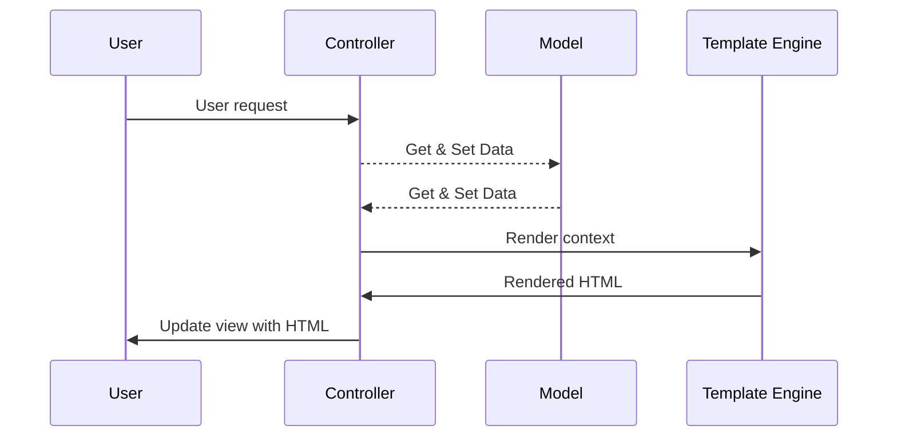
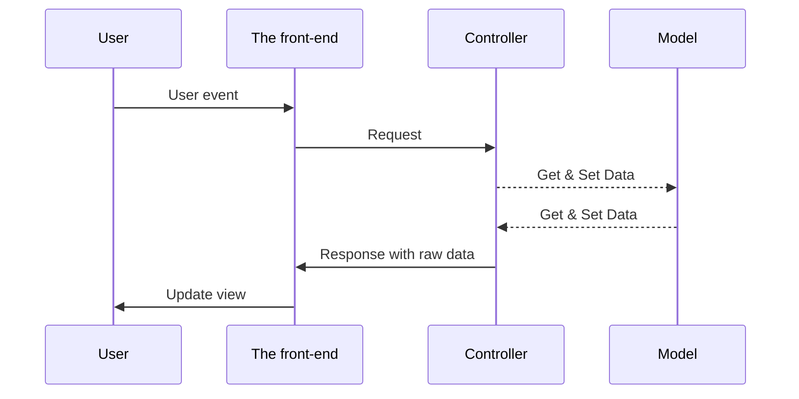

# Introduction to Web Development

Hi, Django

---
layout: image-right
image: 'https://res.cloudinary.com/practicaldev/image/fetch/s--iEmy2OHM--/c_imagga_scale,f_auto,fl_progressive,h_900,q_auto,w_1600/https://dev-to-uploads.s3.amazonaws.com/uploads/articles/4bv6tjo2s9zq7oycou2x.jpeg'
---

# Django

- A Python-based web framework
- Easy to use
- Initial release in 2015
- Based on **MVC** architecture
- Consists an **ORM (Object-relational mapper)**

## **Sites using django**:

- [Pinterest](https://www.pinterest.com)
- [Mozilla](https://www.mozilla.org)
- [NIMO](https://nimo.sjtu.edu.cn)

---
layout: image-right
image: 'https://user-images.githubusercontent.com/89176673/150480808-a3a66daa-05bd-487e-ae63-1b6140f6dc9c.png'
---

# The MVC Architecture

> Reference: https://developer.mozilla.org/en-US/docs/Glossary/MVC

<br>

## Model

- Data model in the app
- Example: We describe a note should have
  + an id 
  + a title
  + the content
- Load & Save data

---
layout: image-right
image: 'https://user-images.githubusercontent.com/89176673/150480808-a3a66daa-05bd-487e-ae63-1b6140f6dc9c.png'
---

# The MVC Architecture

> Reference: https://developer.mozilla.org/en-US/docs/Glossary/MVC

<br>

## View

- Displaying data
- The part that interact with user
- For web application, it is the webpages (the HTML files)
- For GUI, it is the windows (layouts of elements)

---
layout: image-right
image: 'https://user-images.githubusercontent.com/89176673/150480808-a3a66daa-05bd-487e-ae63-1b6140f6dc9c.png'
---

# The MVC Architecture

> Reference: https://developer.mozilla.org/en-US/docs/Glossary/MVC

<br>

## Controller

- Handle user's input
- Make changes to data
- Update the view

Image from: https://github.com/YashShah138/Team-MicrosoftTechSupport/wiki/MVC

---

# How we serve webpages

## By template

- The result generated by controller is passed to template as data
- The template engine fill the data to the 'blanks' and output in HTML format
- The output then send back to the user

## Separate Front-end with API

- The result generated by controller is directly returned to user
- The Separate front-end receive the raw data (usually in `json` or `xml` format)

---

# Serve webpage by template



---

# Serve webpage by separate front-end 



---

# Writing your first Django App

**Installation**

```bash
pip install Django
```

Note: You can create a virtual environment with `venv`

**Start a project**

```bash
django-admin startproject pastebin
```

**Start an application in project**

```bash
python manage.py startapp snippets
```

---
layout: intro-image
image: 'https://source.unsplash.com/collection/94734566/1920x1080'
---

# Thanks 
